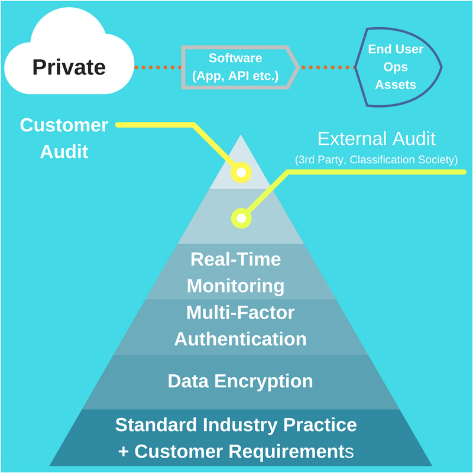

+++ 
date = "2017-10-25"
title = "Cybersecurity - Why It's Very Important For The Oil and Energy Industry"
slug = "cybersecurity-oil-and-energy-industry"
tags = ["cybersecurity","digitalisation","awareness","digital-vulnerabilities"]
categories = ["startup","corporate","oil","energy"]
+++

2017 has seen [very serious and significant data breaches](https://www.wired.com/story/2017-biggest-hacks-so-far/) across several industries. 

The recent revelation that Equifax had been the target of a hack - an organisation that handles the personal data of millions of US citizens - resulted in the exposure of personal details such as names, date of birth, social security numbers and more.

Additionally, we have seen a co-ordinated, large scale threat across different private and public entities in the spread of a ransom-ware called "Wannacry". This restricted operations in hospitals, treatments of patients by blocking computers and asking for a fee to be paid to regain access to the said computers. Luckily, a "kill switch" was discovered in the ransom-ware code and it was eventually evacuated from computers after weeks of cleanup operations and millions of dollars of damage.

As our world relies heavily on the supply and security of energy, any disruption in this supply chain - exploration, development, production, distribution - can have far-reaching and devastating consequences. Examples being reputation damage of an organisation, environmental disaster or loss of human life.

While the Oil & Energy sector moves towards Digitalisation of their operations and work practices, Cybersecurity will play a vital role to ensure the safeguarding of energy producing assets, people and customers needs.

This article gives a high-level overview of key areas in the energy supply chain that require strong layers of Cybersecurity protection.

**Oil and Gas**

*_1. Upstream_*

Drilling vessels are complex pieces of equipment used to drill wells offshore. To ensure quality and safe operations, state-of-the-art engineering simulations of the operations are carried out beforehand. These simulations use proprietary data unique to each vessel and is a corporate asset that must be protected.

Any mismanagement of this data could compromise the value of the asset and associated contracts that it is part of.

*_2. Midstream_*

Midstream Oil & Gas is particularly focused on the transport of crude oil and gas from the production sites (offshore or onshore) to refineries. This is a high-risk operation where millions of dollars worth of product are transported around the world. Safeguarding these assets from hijacking or ship grounding is mandatory.

A recent example of a cybersecurity threat to this sector is the recent [GPS spoofing of a supertanker](http://www.wired.co.uk/article/black-sea-ship-hacking-russia) in the Black Sea, offshore Russia.

*_3. Downstream_*

Downstream Oil & Gas is the practice of refining crude oil and gas into more usable products like kerosene for aircraft fuel and gasoline for cars etc.

In the event of a cybersecurity breach, monitoring equipment could be configured to cause surges in pressure within transmission lines and cause storage tanks to rupture. This would cause a shutdown of the facility or indeed, lead to a major accident resulting in millions of dollars in losses and lost production output.

**Renewable Energy**

Wind Farms are large arrays of turbines that harness wind energy and convert it into electricity which is then sent to a substation. This substation is then indirectly connected to the power supply grid nearby which supplies towns, cities and industry.

[Recent research](https://www.wired.com/story/wind-turbine-hack/) has shown how easy it is to physically access the servers that control these energy producing assets. The operation of a sole wind turbine could be compromised by causing it to:

1. Stop rotating (falsifying a shutdown for maintenance)
2. Change its direction (usually, they face the direction of the wind to optimise efficiency)
3. Report false information that could cause a power surge which could cause significant damage to the substations

Wind Turbines are making significant technological progress and with their ever-lowering cost per kilowatt hour, they are expanding their energy market share year-on-year. Yet, as they become more integrated into the energy supply chain, they too must consider Cybersecurity as a top priority.

**Strategies**

Different mentalities are needed to counteract cybersecurity threats and this requires experience from other industries which can be added to existing in-house knowledge.

*_Security Stack_*

At Computation Hub, we propose a wide-ranging "security stack" for our [Digital Hub](/#_software_as_a_service). This can also be applied for custom applications in a **Private Cloud** environment. As organisations, looking to connect assets to the internet for remote monitoring and control, a sound, well planned strategy needs to be set in place.

*_Corporate Data Managment_*

Today, as data generation within Exploration and Production companies grows exponentially, it appears that a "clear enterprise data management strategy" is required [(Source: Emmanuel Udeh, Subsurface Data Analyst at Shell)](http://www.etlsolutions.com/big-data-in-oil-gas-implications-for-the-ep-organization/). To address issues around data and strategy, one solution would be to create a role of "Chief Data Officer" to work alongside the Chief Information Officer. With the right implementation and patience, it can lead to robust practices being developed because lines of communication can be clear within the organisation.

*_Chief Data Officer (CDO)_*

According to Gartner, in 2017, 27% of organisations have a CDO. A CDO is a person who addresses "data management, integration, and utilization challenges" (Source: [Forbes](https://www.forbes.com/sites/kimberlywhitler/2016/10/22/what-is-a-chief-data-officer-and-why-do-firms-need-them/#6ee8a1f8bc94)). Definitely, in the Oil & Gas sector, this will become an upcoming requirement for the industry to meet future data related challenges (security and ownership notably).

**Conclusion**

There are plenty of new technologies to integrate into existing systems. This can pose a challenge in protecting company IT infrastructure, vessels, turbines, refining equipment. Nevertheless, the industry is capable of planning and adapting to the required changes to welcome these technologies. This will mean that new roles such as the Chief Digital Officer will need to be considered. 

Dedicated security stacks need to be carefully thought out, hand-in-hand with a risk assessment of asset or operation to be protected.