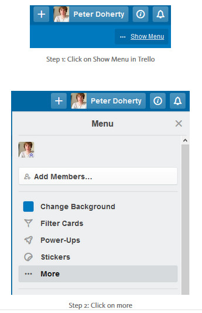

+++ 
date = "2016-07-24"
title = "Email Trello For Simplified Task Management"
slug = "email-trello-simplified-task-management"
tags = ["saas","tools","trello","kanban"]
categories = ["productivity"]
+++

#### Juggling tasks

I use [Trello](https://trello.com/peterdoherty3/recommend) to manage my personal tasks, my personal life and my technology startup. As you can imagine, I have lots to do. Most of my tasks come in via email, but some arise as I think of them or from speaking to other people. I use Trello boards to organise those tasks into different groups. Most of the tasks I have to execute come through my Gmail account. I needed a way to have one point of reference which updates automatically whilst in the office or on the go, across whatever device I’m on.

#### E-mail [Trello](https://trello.com/peterdoherty3/recommend) with magic

Generally, e-mail clients have task tracking capability. I find with all the noise and distraction email inboxes bring, tasks get neglected. Moreover, I can’t share tasks to a central, common location (e.g. for other team members) or easily flag an email I sent, which needs following up.

Thankfully, Trello has a great, yet somewhat hidden feature called “Add Tasks via Email”. It allows you or your team to commit tasks to Trello via a new email or a forwarded email. I compiled a brief description of how it works. Further below is a step by step guide of my setup.

#### How it works

Go to your settings in Trello. Copy the automatically generated email Trello provides and add it to a new contact in your email client — give it a name you or your team can remember well.

You can either create a new email with the subject title as the name of the card. The body of the email is the description. Ensure you use sensible words and keep it brief if a forwarded email is used.

#### Step by Step

#### Results

#### Final Thoughts

Add cards via email is a slick function in Trello. There are many ways to use it. It’s a shame the feature is hidden away in two sub-menus. Of course there are other task management tools out there. It’s just a matter of preference. Additionally, you could always try those complicated rules in Outlook.

It’s all down to trying and testing out what suits your style in order to have a efficient method to log tasks and mange them.

I hope you found this helpful. If you did then please like and/ or share!